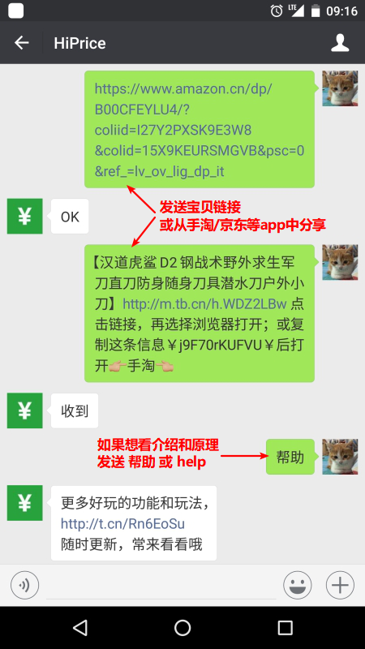

# hiprice-chatbot
HiPrice 微信机器人。

## HiPrice
HiPrice 是一个微信个人号机器人。

给他发送或分享商品链接，它会定时爬取这些商品信息，在涨价/降价的时候通知你。

_我已经部署了一个机器人，想使用这个提醒服务或想看看效果请添加微信好友 __hiprice001__。_




目前支持以下电商网站：

- 淘宝/天猫
- 京东
- 苏宁易购
- 亚马逊（中国）
- 唯品会
- 聚美优品
- 蘑菇街
- 网易考拉

## Docker

```
// 构建镜像
docker image build -f Dockerfile -t hiprice-chatbot .

// 运行镜像
docker container run -d --name hiprice-chatbot -p 6200:6200 --link mariadb:mariadb --link beanstalk:beanstalk hiprice-chatbot

// 如果不想自己构建，可以使用默认的镜像
docker container run -d --name hiprice-chatbot -p 6200:6200 --link mariadb:mariadb --link beanstalk:beanstalk wf2030/hiprice-chatbot:0.1.0
```

### MariaDB

镜像：`wf2030/mariadb:10.3`，或者在 mariadb 目录中自行构建。

运行：`docker container run -d --name mariadb -p 3306:3306 -e MYSQL_ROOT_PASSWORD=root wf2030/mariadb:10.3`

### Beanstalk

镜像：`wf2030/beanstalk:1.11`，或者在 beanstalk 目录中自行构建。

运行：`docker container run -d --name beanstalk -p 11300:11300 wf2030/beanstalk:1.11`

### 提示

目前整个项目分为4个子项目（正在重构）：

- [hiprice-chatbot](https://github.com/kwf2030/hiprice-chatbot)
  HiPrice 微信机器人。包括一个用于登录的控制台页面。需要 MySQL/MariaDB 和 Beanstalk。
- [hiprice-dispatcher](https://github.com/kwf2030/hiprice-dispatcher)
  HiPrice 任务分发。收集商品链接分发给爬虫。需要 MySQL/MariaDB 和 Beanstalk。
- [hiprice-runner](https://github.com/kwf2030/hiprice-runner)
  HiPrice 爬虫。可以部署任意多节点，因为爬虫是天然"分布式的"。需要 Beanstalk 和 Chrome/Chromium。
- [hiprice-web](https://github.com/kwf2030/hiprice-web)
  HiPrice Web 页面。管理已关注的商品。

你可能会需要 [docker-compose](docker-compose.yaml) 一键启动所有服务，docker-compose 没有包括爬虫，需要手动编译运行。

所有服务运行起来后，进入 http://localhost:6200/admin 登录微信机器人，登录后即全部搞定！给机器人发送“帮助”看看如何玩转它。

__注意：微信机器人使用备注作为持久化方案，它会使用序列号备注你所有的联系人，这意味着你之前的备注都将被覆盖且无法恢复，请谨慎使用（如果想要测试，可以使用我部署的 hiprice001，或重新申请一个微信号)。__
